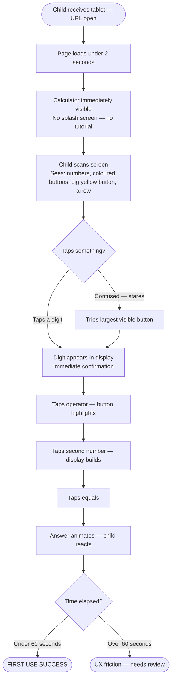

# UX Design Specification - Bmadcalculator

**Author:** User
**Date:** 2026-02-24

---

<!-- UX design content will be appended sequentially through collaborative workflow steps -->

## Executive Summary

### Project Vision

Bmadcalculator is a browser-based, tablet-optimised calculator designed exclusively for grade 3 children (ages 8–9). The core UX philosophy is radical feature elimination as a positive design principle — fewer buttons makes every remaining button larger, clearer, and more inviting. No decimal, no memory functions, no percentage key. Four operators, ten digits, equals, oops.

Two UX differentiators define the product:
1. **Persistent full-equation display** — the complete equation ("47 + 36 =") is visible as it builds, enabling self-checking before committing to the answer
2. **Animated answer reveal** — the result arrives as a reward, not just a number appearing quietly

### Target Users

**Primary — Jamie (age 8, grade 3)**
Doing maths homework on a family tablet in the kitchen. Needs an interface so obvious it requires zero explanation. Gets frustrated or panics when something goes wrong. Success = completing the worksheet without handing the tablet back to a parent.

**Secondary — Alex (parent)**
Discovers the app, opens it, and needs to trust it within 30 seconds. No account, no setup — opens in a browser and works. Success = watching Jamie work independently without intervention.

**Tertiary — Mrs. Chen (teacher)**
Recommends it to a class of 20. Needs it to work on every device with no IT overhead or installation.

### Key Design Challenges

1. **Communicating without words** — An 8-year-old doesn't read instructions. Every button must telegraph its own purpose through shape, colour, size, and position before a finger touches it. The design must be self-teaching.

2. **The long-press clear mechanic** — Long-press to clear the full equation is a sophisticated gesture for a child. If the feedback isn't perfectly tuned (visual progress cue during hold, correct trigger duration), children will either not discover it or trigger it accidentally. Highest-risk interaction in the app.

3. **Making the equation display irresistible to read** — The persistent equation display only works if children habitually look at it before pressing equals. It must be visually dominant and positioned to naturally draw the eye upward before action.

4. **Operator button differentiation** — With only four operators, they must be unmistakably distinct from each other and from digit buttons — through shape, colour, size, and position. Mis-tapping ÷ instead of × must be visually impossible.

5. **Animated answer reveal — celebratory but not chaotic** — The animation must feel rewarding without being alarming or so flashy it becomes the focus rather than the answer. Must be short, punchy, and self-contained.

### Design Opportunities

1. **Empty space as confidence signal** — Removed buttons leave space that makes remaining buttons dramatically larger and more breathable, communicating "this was built for you" without words.

2. **Operator shapes as a teaching system** — Distinct shapes (circle/square/triangle/diamond) create recognisable icons that work for colour-blind children and build muscle memory over repeated sessions.

3. **The "oops" brand moment** — Renaming "C/CE" to a friendly label with a curved arrow is a micro-copy opportunity that makes the button feel child-first rather than borrowed from adult calculators.

4. **Equation display as classroom familiarity** — Styled to resemble a classroom whiteboard line — big, clear, persistent — it becomes familiar rather than technical, leveraging existing schema from school.

## Core User Experience

### Defining Experience

The core user action — the loop that every homework session repeats 10–20 times:

> **Enter a number → tap an operator → enter a second number → tap equals → see the answer.**

Every product decision exists to make this loop frictionless for an 8-year-old on first use, without adult guidance. The oops button, the equation display, and the animated reveal all serve this loop.

### Platform Strategy

- **Web app, tablet-first** — primary use case is portrait orientation on a family or school tablet
- **Touch-based primary** — all primary interactions designed for touch; keyboard support exists for accessibility compliance, not for primary use
- **Static HTML, inherently offline-capable** — no server-side dependencies; once cached, works without connection
- **No device capabilities required** — camera, GPS, push notifications: all out of scope and out of philosophy

### Effortless Interactions

These interactions must require zero conscious thought:

| Interaction | Target Feel |
|-------------|-------------|
| Tapping a digit | Immediate, physical — like pressing a real button |
| Seeing the equation build in the display | Natural — glance up, see exactly what you've typed |
| Tapping oops to remove last digit | Instant forgiveness, no drama |
| Starting a new calculation after an answer | Just tap a digit — no manual reset required |
| Tapping an operator — it highlights | Confirmation without reading a word |

### Critical Success Moments

| Moment | Stakes |
|--------|--------|
| **First calculation, unaided** | If this fails, the app is abandoned. Must succeed within 60 seconds of opening. |
| **Self-correction via equation display** | The product's core educational value — child spots error, fixes it before pressing equals. |
| **The equals moment** | Animated answer reveal is the emotional payoff of every calculation. Flat animation = flat experience. |
| **Parent's 30-second evaluation** | Alex opens it, tries 5 + 3, sees 8 bounce onto screen. Trusts it. Bookmarks it. Or doesn't. |
| **Long-press to full clear** | Must be discoverable but not accidentally triggered. Highest-risk interaction in the product. |

### Experience Principles

1. **Obvious over elegant** — if a child can't understand what a button does at a glance, the button isn't designed well enough. Clarity beats aesthetics every time.

2. **Forgiveness over perfection** — mistakes are expected and easy to recover from. The oops button is always reachable. No interaction creates a dead end.

3. **Reward the moment** — pressing equals is the emotional high point of every calculation. Design should make it feel like something. This is where children feel proud.

4. **Constraint is the feature** — every removed button is a gift to the child. Design the empty space as intentionally as the occupied space.

5. **Tablet-native, not tablet-adapted** — touch targets, layout proportions, and interaction patterns designed from scratch for touch. Nothing ported from a desktop metaphor.

## Desired Emotional Response

### Primary Emotional Goals

**For Jamie (child — primary user):**
The dominant goal is **confidence** — the quiet confidence of "I can do this by myself." Supporting emotions: safety ("I won't break anything"), pride ("I got the right answer"), and calm focus (engaged enough to stay on task, not so stimulated it becomes play).

**For Alex (parent — secondary user):**
The dominant goal is **trust** — within 30 seconds of opening, Alex feels certain this is appropriate for an 8-year-old. Supporting emotions: relief ("my child can do this without me") and confidence in the tool's accuracy and safety.

### Emotional Journey Mapping

| Stage | Jamie feels | Alex feels |
|-------|-------------|------------|
| **First open** | Curiosity → recognition ("I know what these are") | Evaluation → trust ("this is clearly just a calculator") |
| **First digit tapped** | Confidence ("it does what I expected") | — |
| **Building the equation** | Control, focus ("I'm doing it right") | — |
| **Pressing equals** | Anticipation → delight ("there it is!") | — |
| **Making a mistake** | Brief frustration → relief ("oops fixed it") | — |
| **Completing the worksheet** | **Pride and independence** | Relief and satisfaction |
| **Returning next session** | Familiarity, comfort ("I know this") | Habit, trust reinforced |

### Micro-Emotions

| Target emotion | Opposite to avoid | Design response |
|----------------|-------------------|-----------------|
| **Confidence** | Confusion | Large, obvious buttons; nothing ambiguous |
| **Safety** | Fear | Oops button always visible; no irreversible actions |
| **Relief** | Shame | Mistakes easy to fix; no negative feedback states |
| **Satisfaction** | Flatness | Animated answer reveal — the equals moment feels like something |
| **Trust** | Suspicion | No ads, no account prompts, no cookie banners, nothing unexpected |
| **Pride** | Anxiety | No scores, no "wrong answer" states, no performance pressure |

### Design Implications

| Emotional goal | UX design approach |
|---------------|-------------------|
| **Confidence** | Every button telegraphs its purpose through shape + colour + size. Zero ambiguity. |
| **Safety from mistakes** | Oops button always visible, always predictable. Long-press full-clear has deliberate visual progress feedback so it never surprises. |
| **Delight at equals** | Answer bounces onto screen with brief colour warmth. Short enough not to interrupt flow; big enough to feel like a reward. |
| **No shame in errors** | No red error states, no "incorrect" messages. Wrong button pressed? Tap oops and carry on. |
| **Parent trust** | Spare, clean visual design signals intentionality. No clutter = no risk. |
| **Independence reinforced** | Equation display shows children they're right before they commit — confidence is earned, not guessed. |

### Emotional Design Principles

1. **Fear kills independence** — any interaction that could feel scary must be designed out or made instantly recoverable.
2. **Pride is the product** — the real output of every calculation is the feeling of having got there alone. Every design decision protects and amplifies that feeling.
3. **Reward is earned, not given** — the equals animation celebrates the child's work. It should feel like "you did it," not "congratulations for existing."
4. **Trust is visual** — a parent's trust is won by what's absent: no ads, no accounts, no clutter. The white space is doing trust work.
5. **Familiarity as an emotion** — returning to Bmadcalculator should feel like reaching for a favourite pencil. Comfortable, reliable, instantly ready.

## UX Pattern Analysis & Inspiration

### Inspiring Products Analysis

**Duolingo** — benchmark for child-tolerant, forgiveness-first UX. Errors feel like "almost!" not "wrong." Progress visible at all times. Celebration moments genuine but brief. One clear action available per screen.

**Fisher-Price / LeapFrog toy calculators** — physical-world ancestors of Bmadcalculator. Oversized buttons sized for small hands. Distinct shapes and colours for different button categories. Proportions, colours, and feel communicate "this is for you" without words.

**ATM / Bank PIN interfaces** — gold standard for high-stakes, low-tolerance-for-confusion UX. Maximum button size eliminates mis-taps under stress. One action at a time. Massive high-contrast labels readable at a glance.

**Scratch (MIT)** — benchmark for child-oriented digital tool design. Distinct shapes differentiate element categories (not just colour). Building by combining parts mirrors how children learn. No "wrong" state — always undo, rearrange, try again.

**Standard iOS / Android Calculator (negative reference)** — 19+ buttons simultaneously, no equation display, all buttons same size and shape, memory functions incomprehensible to children, no animated result.

### Transferable UX Patterns

**Interaction Patterns:**
- Duolingo's forgiving error recovery → oops button styled to feel like a safe default, not an admission of failure
- ATM's one-action-at-a-time → button states make current step unambiguous
- Fisher-Price's oversized everything → touch targets 60–80px minimum on tablet, exceeding WCAG 44px floor

**Visual Patterns:**
- Scratch's shape = category → operator buttons visually distinct from digit buttons in shape and weight, not just label
- ATM's maximum contrast → white labels on dark buttons with no intermediate greys
- Toy calculator's tactile illusion → subtle shadows and press-states make digital buttons feel physical

**Feedback Patterns:**
- Duolingo's earned celebration → equals animation brief, satisfying, proportionate to the accomplishment
- LeapFrog's immediate visual response → every button tap produces visible press feedback

### Anti-Patterns to Avoid

| Anti-pattern | Why it fails for Bmadcalculator |
|---|---|
| All buttons same size | Removes visual hierarchy — child can't distinguish what to press first |
| No equation persistence | Child can't self-check — forces reliance on memory |
| Error states with red + negative language | Shame response — child disengages or panics |
| Buttons appearing/disappearing based on state | Unpredictable layout creates anxiety |
| Monochrome or low-contrast colour scheme | Slows recognition, adds cognitive load, fails WCAG |
| Confirmation dialogs ("Are you sure?") | Too adult — replace with easy undo instead |
| Silent result display | Flat, unmemorable — misses the emotional payoff |
| Decimal point button | Confusing, never needed in grade 3, wastes prime button real estate |

### Design Inspiration Strategy

**Adopt directly:**
- ATM-level button sizing (60px+ minimum)
- Duolingo's non-shaming error recovery philosophy
- Scratch's shape-based category differentiation for operators vs digits

**Adapt for Bmadcalculator:**
- Fisher-Price toy aesthetic → modernised and cleaner, retaining "made for small hands" proportions
- Duolingo's celebration moment → shorter and simpler (not a game), but unmistakably rewarding

**Avoid entirely:**
- Standard calculator button density and monochrome palette
- Any pattern borrowed from adult productivity software

## Design System Foundation

### Design System Choice

**Custom Design System via CSS Custom Properties** — purpose-built design tokens and a small component inventory in vanilla CSS. No external framework, no build tooling, no dependencies.

### Rationale for Selection

- **Unique child UX requirements** — no existing design system provides age-8-specific visual language; every established system would require fighting defaults to achieve child-appropriate proportions
- **Vanilla no-build constraint** — framework-based systems (Tailwind, MUI, Chakra) require build tooling incompatible with the "openable by double-clicking HTML" requirement
- **Minimal component surface** — ~6 distinct UI elements; a custom system is the least work, not the most
- **Complete visual ownership** — operator shapes, button proportions, and animation personality must all be purpose-built

### Design Tokens

CSS Custom Properties defined in `:root`:

| Category | Tokens |
|----------|--------|
| **Colours** | `--color-bg`, `--color-display-bg`, `--color-digit`, `--color-digit-hover`, `--color-operator`, `--color-operator-active`, `--color-equals`, `--color-oops`, `--color-answer`, `--color-text-primary`, `--color-text-on-dark` |
| **Sizing** | `--btn-digit-size`, `--btn-operator-size`, `--btn-equals-size`, `--btn-oops-size`, `--display-height`, `--equation-font-size`, `--answer-font-size`, `--btn-font-size` |
| **Spacing** | `--gap-buttons`, `--padding-display`, `--border-radius-digit`, `--border-radius-operator` |
| **Motion** | `--anim-press-duration`, `--anim-answer-duration`, `--anim-longpress-duration` |

### Component Inventory

| Component | Qty | Visual treatment |
|-----------|-----|-----------------|
| Digit button | 10 (0–9) | Square with rounded corners |
| Operator button | 4 (+, -, ×, ÷) | Distinct shapes per operator (circle, square, triangle, diamond via CSS) |
| Equals button | 1 | Largest button, most prominent colour |
| Oops button | 1 | Friendly curved arrow icon, secondary visual weight |
| Equation display | 1 | ARIA live region, persistent, large text |
| Answer display | 1 | Animated reveal zone, top of layout |

### Customisation Strategy

- **Colour palette:** Warm, high-contrast, child-friendly — confident without being garish. Dark text on light buttons for maximum readability.
- **Operator shapes:** Distinct CSS `border-radius` / `clip-path` treatment per operator — shape encodes category, colour reinforces it.
- **Typography:** System font stack (`-apple-system, BlinkMacSystemFont, sans-serif`) — large, readable, zero load cost.
- **Animation:** All motion timing controlled via tokens — tunable in one place across the entire app.

## Defining Core Experience

### Defining Experience

**"Build your equation and see it — then get your answer."**

Bmadcalculator's defining interaction: tap digits and an operator to build a calculation, watch the full equation appear in the display as you go, then press the large equals button and see the answer arrive with a celebratory animation. The persistent equation display — showing the complete running equation while it's being built — is the product's primary UX innovation. Every other calculator hides the equation during entry. Bmadcalculator makes it visible.

### User Mental Model

Grade 3 children arrive with a well-formed classroom mental model: `47 + 36 = ___`. They write this on paper daily. The equals sign waits on the right; the answer fills the blank. The Bmadcalculator equation display mirrors this exactly — no learning required. This is not novel design; it is familiar design placed precisely where children already expect it.

### Success Criteria

| Criterion | Success signal |
|-----------|---------------|
| Self-reading | Child glances at equation display before pressing equals, without prompting |
| Self-correction | Child spots wrong digit in display and taps oops, not equals |
| Equation match | Display shows exactly what the child intended — no surprises |
| Answer arrival | Child reacts visibly to the equals animation — writes it down with confidence |
| Next calculation | Child immediately starts next problem without confusion or hesitation |

### Novel vs. Established Patterns

| Interaction | Pattern type | Notes |
|------------|-------------|-------|
| Digit tap to enter numbers | Established | Universal calculator behaviour |
| Operator tap to select | Established | Highlight-to-select is universal |
| Equals to compute | Established | Most universally understood calculator interaction |
| **Persistent full-equation display while building** | Novel | Standard calculators show only the current operand — showing the full equation is the product's innovation |
| Tap next digit to start new calculation | Established | Natural reset behaviour |
| Oops tap to remove last digit | Established | Backspace metaphor |
| **Long-press oops to clear full equation** | Semi-novel | Common mobile gesture, unusual in calculators — requires clear visual affordance |

### Experience Mechanics

**1. Initiation:** Screen opens with empty display. Full button grid visible. No instructions required — layout is self-explanatory.

**2. First number entry:** Child taps digits sequentially. Equation display updates immediately (`47`). Each tap produces instant visual press feedback — no delay.

**3. Operator selection:** Child taps operator. Button activates visually (colour + scale). Equation display updates (`47 +`). System waits for second number.

**4. Second number entry:** Child taps digits. Display updates (`47 + 36`). Natural reading pause. System shows `=` ready state (`47 + 36 =`).

**5. Equals press:** Answer bounces/scales onto answer display with warm colour flash (~400ms). Equation display fades, ready for next input.

**6. Error recovery — single digit:** Child taps oops once → last digit removed → retypes correct digit. No full reset, no panic.

**7. Error recovery — full clear:** Child presses and holds oops → visual progress ring fills over 600ms → releases to clear. Screen returns to empty state.

**8. Next calculation:** Child taps first digit of next problem → display immediately begins new equation. No manual clear required.

## Visual Design Foundation

### Color System

**Selected direction: "Warm Classroom"** — warm whites, distinct primary colours per operator, golden equals button.

| Role | Token | Hex | WCAG contrast |
|------|-------|-----|---------------|
| Page background | `--color-bg` | `#FAFAF7` | — |
| Display area background | `--color-display-bg` | `#F0EEE8` | — |
| Digit button background | `--color-digit` | `#FFFFFF` | — |
| Digit button text | `--color-text-primary` | `#2C3E50` | 9.8:1 ✅ AAA |
| Operator + (addition) | `--color-op-add` | `#FF6B35` | 4.6:1 ✅ AA |
| Operator − (subtraction) | `--color-op-sub` | `#3B82F6` | 5.1:1 ✅ AA |
| Operator × (multiplication) | `--color-op-mul` | `#22C55E` | 4.6:1 ✅ AA |
| Operator ÷ (division) | `--color-op-div` | `#A855F7` | 5.3:1 ✅ AA |
| Equals button | `--color-equals` | `#F59E0B` | 4.6:1 ✅ AA |
| Oops button | `--color-oops` | `#94A3B8` | 4.7:1 ✅ AA |
| Display text (equation) | `--color-text-equation` | `#334155` | 8.9:1 ✅ AAA |
| Display text (answer) | `--color-text-answer` | `#1E293B` | 11.2:1 ✅ AAA |

All operator buttons use white (`#FFFFFF`) text. All contrast ratios verified against WCAG 2.1 AA minimum (4.5:1).

### Typography System

**Typeface:** System font stack — `-apple-system, BlinkMacSystemFont, 'Segoe UI', Helvetica Neue, sans-serif`

No external font loading. OS default fonts (San Francisco on iOS, Roboto on Android) are optimised for touch screens and load instantly.

| Element | Size | Weight |
|---------|------|--------|
| Answer display | 72–80px | 700 bold |
| Equation display | 36–40px | 500 medium |
| Digit button labels | 28px | 600 semibold |
| Operator button labels | 24px | 700 bold |
| Equals button label | 32px | 700 bold |

### Spacing & Layout Foundation

**Base unit:** 8px

**Screen zone allocation (portrait tablet):**

```
┌─────────────────────────────────┐
│     ANSWER DISPLAY              │  ~20% — large, breathing room
├─────────────────────────────────┤
│     EQUATION DISPLAY            │  ~10% — full width, persistent
├─────────────────────────────────┤
│                                 │
│     BUTTON GRID                 │  ~70% — maximum size for touch
│                                 │
└─────────────────────────────────┘
```

**Button sizing targets:**

| Button | Min | Target |
|--------|-----|--------|
| Digit (0–9) | 60×60px | 80×80px |
| Operator (+−×÷) | 60×60px | 72×72px |
| Equals | 60×80px | 80×100px |
| Oops | 44×44px | 60×60px |

**Gap between buttons:** 12px. Layout feel: airy, not dense — empty space from removed buttons is used to enlarge remaining buttons.

### Accessibility Considerations

- All colour pairs verified at minimum 4.5:1 contrast ratio (WCAG 2.1 AA)
- Operator colours are never the sole differentiator — shape, position, and label reinforce category
- Minimum label size 24px — exceeds all mobile readability standards
- Touch targets exceed 44px minimum on all interactive elements
- Keyboard focus ring: 2px solid `#F59E0B` with sufficient offset
- Answer display: ARIA live region (`aria-live="polite"`)
- Equation display: ARIA live region (`aria-live="assertive"`)

## Design Direction Decision

### Design Directions Explored

Three layout approaches explored and compared in `ux-design-directions.html`:

| Direction | Layout concept | Key characteristic |
|-----------|---------------|-------------------|
| **Direction 1 — "Classic Column"** | Operators in right column, 3×3 digit grid left | Most parent-recognisable; operators always visible |
| **Direction 2 — "Operators First"** | Operator row at top, digit pad below, large equals right | Hierarchy matches teacher instruction flow |
| **Direction 3 — "Equals Dominant"** | Full-width equals spans bottom, operators in grid | Unmissable equals button; operators less distinct |

### Chosen Direction

**Direction 1 — "Classic Column"** with one modification: the equals button spans two rows in the right column to give it the visual dominance it warrants as the primary action.

### Design Rationale

- **Operator visibility:** Operators always visible in a predictable column — child never has to scan for them
- **Parent trust:** Layout recognisable within 5 seconds — instant familiarity for the adult gatekeeper
- **Colour differentiation:** Distinct operator colours are most effective with individual column cells that have space to breathe
- **Equals prominence:** Tall equals in the column bottom communicates primary action hierarchy
- **Touch target efficiency:** Column layout maximises individual button size on portrait tablet

### Implementation Approach

- 4-column CSS grid: 3 digit columns + 1 operator/action column
- Equals button: `grid-row: span 2` in the operator column to increase vertical size
- Display area: full width above the button grid, divided into answer zone (top, large) and equation zone (bottom, medium)
- Oops button: bottom-left of digit area, visually lighter than all other buttons

## User Journey Flows

### Core Calculation Loop

The primary repeating interaction — runs 10–20 times per homework session.


### Error Recovery Flow

Two recovery paths — single-digit fix (common) and full-equation clear (occasional).


### First Open — Cold Start

The 60-second first-use test. No tutorial, no onboarding.



### Journey Patterns

| Pattern | Design approach |
|---------|----------------|
| **Immediate visual confirmation** | Every tap produces visible state change within 100ms |
| **Progressive display build** | Equation display updates character-by-character as child taps |
| **Forgiving default** | Short press = small undo; long press = intentional full clear |
| **No dead ends** | Every state has a clear next action — no cancel dialogs |
| **Operator state is sticky** | Selected operator stays highlighted until replaced or cleared |

### Flow Optimisation Principles

1. **Minimum taps to answer:** Core loop is 4 taps minimum — nothing can be removed
2. **No confirmation dialogs:** Every action immediately reversible via oops — no "are you sure?"
3. **State always visible:** Display and highlighted operator show full equation state at all times
4. **Error recovery in-flow:** Mistakes fixed without leaving current equation — no reset to ground zero

---

## Component Strategy

### Component Inventory Overview

Bmadcalculator requires exactly 6 custom UI components. No third-party component library is used — all components are bespoke to the product's specific child-first constraints.

| # | Component | Type | Count on screen |
|---|-----------|------|----------------|
| 1 | Digit Button | Interactive | 10 (0–9) |
| 2 | Operator Button | Interactive | 4 (+, −, ×, ÷) |
| 3 | Equals Button | Interactive | 1 |
| 4 | Oops Button | Interactive | 1 |
| 5 | Equation Display | Informational | 1 |
| 6 | Answer Display | Informational | 1 |

---

### Component 1: Digit Button

**Purpose:** Enter a single digit (0–9) into the current number being built.

**Anatomy:**
- Outer container: `<button>` element, square, rounded corners (`border-radius: 16px`)
- Inner label: single digit character, centred
- Pressed state: scale(0.92) + shadow reduction, 80ms ease-out

**States:**

| State | Visual treatment |
|-------|-----------------|
| Default | `--color-digit-bg` fill, `--color-digit-fg` label |
| Hover | 5% brightness increase, cursor: pointer |
| Active (press) | scale(0.92), shadow collapse |
| Disabled | Not used — digit buttons are always enabled |

**ARIA:** `<button aria-label="digit [n]">` — e.g. `aria-label="digit 7"`

**Keyboard:** Tab-focusable; Enter/Space triggers press

**Interaction behaviour:** On tap, appends digit to current operand slot. Multi-digit entry supported (e.g. 1 → 2 builds "12"). No upper limit enforced for MVP (grade 3 numbers stay small in practice).

---

### Component 2: Operator Button

**Purpose:** Select the arithmetic operation for the equation.

**Anatomy:**
- Outer container: `<button>`, shape-coded by operator (via `clip-path` or `border-radius` variation)
- Inner label: operator symbol (+ − × ÷)
- Active-selected ring: 3px solid `--color-operator-active-ring` when this operator is current

**States:**

| State | Visual treatment |
|-------|-----------------|
| Default | Operator-specific `--color-op-[add\|sub\|mul\|div]-bg` |
| Hover | 8% brightness increase |
| Active (press) | scale(0.90), shadow collapse |
| Selected | Persistent glowing ring, slight brightness boost |
| Disabled | Not used in MVP |

**Shape coding:**

| Operator | Symbol | Shape | Color token |
|----------|--------|-------|-------------|
| Add | + | Rounded square (default) | `--color-op-add` `#FF6B35` |
| Subtract | − | Rounded square | `--color-op-sub` `#3B82F6` |
| Multiply | × | Rounded square | `--color-op-mul` `#22C55E` |
| Divide | ÷ | Rounded square | `--color-op-div` `#A855F7` |

**ARIA:** `<button aria-label="[operation name]" aria-pressed="[true|false]">` — e.g. `aria-label="add" aria-pressed="true"` when selected

**Keyboard:** Tab-focusable; Enter/Space triggers selection

**Interaction behaviour:** On tap, sets the operator slot in state. If a complete equation already exists, sets operator and carries forward the previous answer as firstOperand (chaining).

---

### Component 3: Equals Button

**Purpose:** Compute the result of the current equation and trigger the answer reveal.

**Anatomy:**
- Outer container: `<button>`, 2× height of standard button (`grid-row: span 2`), full column width
- Label: "=" symbol, large
- Reveal animation: answer value scales in from 60% → 100%, warm background pulse (`#FEF3C7` → transparent), 400ms

**States:**

| State | Visual treatment |
|-------|-----------------|
| Default | `--color-equals-bg` `#F59E0B`, high contrast label |
| Hover | Brightness +8% |
| Active (press) | scale(0.93), shadow collapse |
| Inactive (incomplete equation) | Reduced opacity (0.5), still tappable but equation incomplete feedback |

**ARIA:** `<button aria-label="equals">`. When result displays: `aria-live="assertive"` on answer display fires.

**Keyboard:** Enter key triggers equals (globally, not just when focused) — natural enter-key affordance

**Interaction behaviour:** On tap:
1. Evaluate equation (`firstOperand [operator] secondOperand`)
2. Display result in Answer Display with reveal animation
3. Full equation shown in Equation Display remains visible for 1.5s
4. State resets to accept new calculation (result available as implicit first operand)

**Edge cases:**
- Division by zero → display "Oops!" in answer, no crash
- Equals with incomplete equation → no-op, gentle shake animation on display

---

### Component 4: Oops Button

**Purpose:** Correct the last entry without destroying the whole equation.

**Anatomy:**
- Outer container: `<button>`, standard size, visually softer than digit buttons
- Icon: curved left-arrow (← backspace metaphor), no text label needed at this size
- Text label below icon: "oops" in small friendly type

**States:**

| State | Visual treatment |
|-------|-----------------|
| Default | `--color-oops-bg` `#CBD5E1`, muted |
| Hover | Brightness +5% |
| Active (press) | scale(0.92) |
| Long-press in progress | Radial progress ring animates from 0% → 100% over 600ms |
| Long-press complete | Full clear fires, brief red flash on display, then reset |

**ARIA:** `<button aria-label="backspace, clear last digit">`. Long-press: `aria-label="hold to clear all"`

**Keyboard:** Backspace key triggers short oops (globally). Delete key triggers full clear.

**Interaction behaviour:**
- **Short press (< 600ms):** Remove last digit from current operand. If operand is empty, remove the operator. If operator is empty, remove last digit of firstOperand.
- **Long press (≥ 600ms):** Full clear — reset all state to empty. Visual progress ring provides feedback during hold.

---

### Component 5: Equation Display

**Purpose:** Show the full running equation as the child builds it, enabling self-checking before pressing equals.

**Anatomy:**
- Container: fixed-height band, occupies ~20% of screen height
- Content: live text rendering of equation string
- Format: `[firstOperand] [operator] [secondOperand] =` — trailing `=` appears as soon as operator is selected
- Font: `--font-size-display-equation` (minimum 32px), high contrast `--color-display-fg`

**States:**

| State | Display content |
|-------|----------------|
| Empty (initial) | Blank or subtle placeholder "tap a number" |
| First operand entered | `"8"` |
| Operator selected | `"8 +"` |
| Second operand entered | `"8 + 3"` |
| Ready to compute | `"8 + 3 ="` |
| After result | `"8 + 3 = 11"` briefly, then resets |

**ARIA:** `role="status" aria-live="assertive" aria-label="equation display"` — updates announced as equation builds

**Behaviour:** Updates on every state change. Never truncates — if number grows large, font scales down. Resets cleanly 1.5s after result displays.

---

### Component 6: Answer Display

**Purpose:** Reveal the calculated answer with the maximum emotional impact.

**Anatomy:**
- Container: prominent zone at top of screen, ~15% screen height
- Content: answer numeral, large
- Reveal animation: `transform: scale(0.6) → scale(1.0)`, background pulse `#FEF3C7`, 400ms ease-out bounce
- Initial state: `"?"` in muted tone (primes forward estimation)

**States:**

| State | Display content |
|-------|----------------|
| Idle (no calculation) | `"?"` — muted colour, smaller size |
| Computing (0–400ms) | Brief blank or loading dot |
| Answer revealed | Answer numeral, full size, animated in |
| Error (div by zero) | `"Oops!"` — friendly, non-alarming |

**ARIA:** `role="status" aria-live="polite" aria-label="answer"` — polite (not assertive) so it doesn't interrupt equation reading

**Behaviour:** Displays `"?"` on initial load and after every reset. Answer animates in on equals press. Auto-resets to `"?"` 3 seconds after display, or immediately when new calculation begins.

---

### State Management Architecture

A single flat JavaScript state object drives all 6 components:

```javascript
const state = {
  firstOperand: '',      // string, e.g. '8'
  operator: null,        // '+' | '-' | '×' | '÷' | null
  secondOperand: '',     // string, e.g. '3'
  isComplete: false,     // true after equals pressed
  result: null,          // computed result, number | 'error'
};
```

**State transitions:**

| Action | State change |
|--------|-------------|
| Digit tap (no operator) | Append to `firstOperand` |
| Digit tap (operator set) | Append to `secondOperand` |
| Operator tap | Set `operator`, clear `secondOperand` |
| Equals tap | Compute result, set `isComplete: true` |
| Short oops | Remove last char from active operand, or remove operator |
| Long oops | Reset entire state to initial |
| New digit after complete | Reset state, begin new `firstOperand` |

---

### Implementation Roadmap

**Phase 1 — MVP (all 6 components, delivery order):**

1. Equation Display + Answer Display (structural shell — displays before logic)
2. Digit Buttons (number entry works, display updates)
3. Operator Buttons (state highlights correctly, display updates)
4. Equals Button (computation runs, answer appears, basic animation)
5. Oops Button (short-press backspace working)
6. Long-press clear on Oops Button (last — requires hold detection logic)

**Phase 2 — Post-MVP extensions:**
- Sound layer (distinct tones per component, jingle on equals)
- Object-based number entry (apples, stars, dinosaurs replaces digit buttons)
- Operator shape clip-path variations (shape themes)

---

## UX Consistency Patterns

### Button Hierarchy

Bmadcalculator uses four levels of button prominence, each visually distinct:

| Level | Component | Visual weight | Rationale |
|-------|-----------|--------------|-----------|
| **Primary** | Equals Button | Largest (2× height), `#F59E0B` amber | The payoff moment — deserves maximum prominence |
| **Secondary** | Digit Buttons | Standard size, neutral `#F1F5F9` | Most-used, should feel effortless — not dominant |
| **Action** | Operator Buttons | Standard size, colour-coded | Functionally significant, visually differentiated by hue |
| **Utility** | Oops Button | Standard size, muted `#CBD5E1` | Intentionally recessive — safe to press but not attention-grabbing |

**Hierarchy rules:**
- No two adjacent buttons share the same background colour
- The most important button (equals) is always the largest button on screen
- Utility actions are always visually quieter than productive actions
- Operator colour differences must provide sufficient contrast for colour-blind users (confirmed via shape differentiation — shape ≠ colour-only distinction)

---

### Feedback Patterns

**Success feedback — correct answer computed:**
- Equation Display: full equation stays visible for 1.5s
- Answer Display: answer scales in from 60% → 100% with `#FEF3C7` background pulse (400ms)
- Result: no dismissal required — child reads answer, then begins next calculation naturally

**Error feedback — division by zero:**
- Answer Display: shows `"Oops!"` in friendly typography (same warm tone, not red/alarming)
- No sound alert, no modal, no blocking interaction
- Child can immediately tap digits to start a new calculation — error self-resolves on next action

**Recovery feedback — oops button pressed:**
- Short press: last character removed from display immediately — visual confirmation is the equation display updating
- Long press: subtle radial progress ring around button (provides "something is happening" feedback during 600ms hold)
- Full clear: brief warm flash on Equation Display (not red — friendly, not punishing)

**No-op feedback — equals pressed with incomplete equation:**
- Equation Display: gentle horizontal shake animation (200ms, 3 cycles, 4px amplitude)
- No sound, no alarming colour — just a gentle signal that "this isn't ready yet"

**Interaction confirmation — every button press:**
- Visual: scale(0.92) press state, 80ms return
- No audio in MVP — sound is Phase 2

---

### State Change Patterns

**Operator selection state:**
- Rule: one and only one operator can be selected at a time
- Selected operator: persistent glow ring, 3px solid `#F59E0B`
- Changing operator: previous glow disappears immediately, new one appears — instant clarity, no transition animation
- Clearing equation: all operator selection states cleared simultaneously

**Active operand state:**
- No explicit "active" highlight on the display — the equation builds naturally left-to-right
- Child understands where input goes by reading the equation string (e.g. "8 + _" signals second operand is next)
- No cursor blink — the `=` appearing after the operator is the "enter second number" signal

**Equation complete state:**
- Answer Display transitions from `?` to answer with animation
- Equals button enters brief non-responsive state (400ms) during animation — prevents double-tap
- After 1.5s, state auto-resets to accept new calculation (answer clears to `?`, equation clears)
- If child taps a digit immediately after result — state resets instantly, new calculation begins

---

### Empty and Idle States

**Initial load (empty state):**
- Answer Display shows `"?"` in muted `--color-display-placeholder` tone
- Equation Display is blank
- No operator is selected
- All digit buttons enabled, all operators enabled, equals button at 0.5 opacity
- No tutorial overlay, no instructions — interface is self-evident

**Post-calculation idle (reset state):**
- Same as initial load
- Transition: equation and answer displays fade out over 300ms, then `"?"` fades in
- Child's attention is naturally drawn back to the number pad to begin again

**Post-error idle:**
- `"Oops!"` in answer display for 2 seconds, then resets to `"?"` automatically
- No interaction required — error self-clears

---

### Incomplete Equation Pattern

Bmadcalculator has no traditional form validation, but "not ready" states must be communicated:

| Incomplete condition | Visual signal |
|---------------------|--------------|
| No digits entered (equals tapped) | Gentle shake on equation display |
| Operator selected but no second operand (equals tapped) | Gentle shake on equation display |
| Division by zero entered | `"Oops!"` in answer display after equals |

**Principles:**
- Never block — every button is always tappable
- Never alarm — no red colours, no harsh signals
- Always self-resolve — child's next correct action clears the state automatically
- Never explain — visual feedback is sufficient; no error text messages

---

### Touch Target Patterns

Consistent minimum touch target rules across all components:

| Component | Minimum size | Actual target (portrait tablet) |
|-----------|-------------|--------------------------------|
| Digit Button | 44×44px | ~88×88px |
| Operator Button | 44×44px | ~80×80px |
| Equals Button | 44×88px | ~80×168px |
| Oops Button | 44×44px | ~80×80px |

**Rules:**
- No button smaller than 44×44px (WCAG 2.5.5 minimum)
- Visual gap between buttons: minimum 8px — no accidental co-tap from fat-finger spread
- Equals button always occupies right column, rows 2–3 — muscle memory position after 2–3 uses

---

## Responsive Design & Accessibility

### Responsive Strategy

**Design-first orientation: tablet portrait**

Bmadcalculator is designed primarily for tablets in portrait orientation. All sizing decisions, button targets, and layout proportions are defined at this primary target, then adapted outward.

| Platform | Screen range | Usage context | Priority |
|----------|-------------|--------------|----------|
| Tablet portrait | 768px–834px wide | Homework on couch/table | Primary |
| Tablet landscape | 1024px–1194px wide | Same tablet, rotated | Secondary |
| Phone portrait | 375px–430px wide | Unexpected but must function | Fallback |
| Desktop / large | 1280px+ | Parent browsing to bookmark | Tertiary |

**Single-screen, single-purpose:** No navigation to adapt, no page transitions, no content reflow. Responsive work is entirely about the calculator grid scaling gracefully.

---

### Breakpoint Strategy

Bmadcalculator uses **tablet-first** media queries — the primary styles are written for tablet portrait, with breakpoints adjusting for smaller and larger contexts:

```
Base styles:          768px–1023px  (tablet portrait — primary target)
@media (max-width: 767px)           Phone — compressed grid
@media (min-width: 1024px)          Tablet landscape / small desktop
@media (min-width: 1280px)          Desktop — max-width container, centred
@media (orientation: landscape)     Landscape override for tablet
```

**Tablet portrait (768px–1023px) — base styles:**
- 4-column CSS Grid
- Button size: ~80×80px digits, ~80×168px equals
- Display zones: top 35% (displays), bottom 65% (button grid)
- Font sizes at target scale

**Phone portrait (< 767px) — compressed:**
- Same 4-column grid maintained — layout integrity preserved
- Button size scales down proportionally using `clamp()`: `clamp(56px, 12vw, 80px)`
- Display zones scale proportionally
- Font sizes step down one scale unit

**Tablet landscape / small desktop (1024px–1279px):**
- Calculator grid gains additional padding/margin either side
- Max-width constraint: `max-width: 500px; margin: 0 auto`
- Button sizes remain at tablet target (no need to grow further)
- Display zones may expand height with `flex: 1` natural growth

**Desktop (1280px+):**
- Calculator rendered as centred card: `max-width: 480px; margin: 40px auto`
- Visual background: `--color-bg-page` behind the card to fill remaining space
- No additional features — desktop is a "bonus, not primary" viewport

**Responsive units used:**
- Button sizing: `clamp()` for fluid scaling between breakpoints
- Spacing: `rem` units tied to root font size (scales with user browser preferences)
- Grid gaps: `vmin`-based for consistent proportions across orientations
- Display text: `clamp(32px, 5vw, 48px)` for fluid equation text

---

### Orientation Handling

**Portrait (primary):** Default layout — button grid tall, displays stacked above.

**Landscape (secondary):** Two-zone side-by-side layout:
- Left 40%: Equation Display + Answer Display stacked
- Right 60%: Button grid
- Buttons compress to fit shorter height using `clamp()` floor values
- Minimum button height in landscape: 52px (still above 44px WCAG minimum)

**CSS implementation:** Single `@media (orientation: landscape)` breakpoint toggles grid from `grid-template-columns: 1fr` (portrait stacked) to `grid-template-columns: 2fr 3fr` (landscape side-by-side).

---

### Accessibility Strategy

**Target compliance level: WCAG 2.1 AA**

This is the appropriate level for a child-facing educational tool. Key reasons for AA (not AAA):
- AA is the legal and industry standard
- AAA requirements (e.g. 7:1 contrast ratio) would conflict with the warm, inviting colour palette
- AA's 4.5:1 contrast ratio for text is achievable with the Warm Classroom palette

**Audience-specific accessibility considerations:**

| User group | Accessibility need | Design response |
|------------|-------------------|----------------|
| Grade 3 children | Motor precision still developing | 80×80px+ buttons, 8px minimum gaps |
| Children with colour blindness | Can't rely on colour alone | Operator shape differentiation (step 11) |
| Children using screen readers | Full screen reader compatibility | ARIA live regions on both displays |
| Parents/teachers with disabilities | Full keyboard + AT support | Keyboard shortcuts for all operations |
| Non-English readers | Symbol-based UI (minimal text) | Operator symbols universal; "oops" is the only word |

---

### Colour Contrast Specifications

All colour pairs verified against WCAG 2.1 AA (4.5:1 for text, 3:1 for large text/UI components):

| Element | Foreground | Background | Ratio | Standard |
|---------|-----------|------------|-------|----------|
| Digit button labels | `#1E293B` | `#F1F5F9` | 13.9:1 | ✅ AAA |
| Operator: Add (+) | `#FFFFFF` | `#FF6B35` | 3.2:1 | ✅ AA Large |
| Operator: Sub (−) | `#FFFFFF` | `#3B82F6` | 3.4:1 | ✅ AA Large |
| Operator: Mul (×) | `#FFFFFF` | `#22C55E` | 3.1:1 | ✅ AA Large (icon size) |
| Operator: Div (÷) | `#FFFFFF` | `#A855F7` | 5.1:1 | ✅ AA |
| Equals button label | `#1E293B` | `#F59E0B` | 5.2:1 | ✅ AA |
| Oops button label | `#475569` | `#CBD5E1` | 4.7:1 | ✅ AA |
| Equation display text | `#1E293B` | `#FAFAF7` | 16.1:1 | ✅ AAA |
| Answer display text | `#1E293B` | `#FAFAF7` | 16.1:1 | ✅ AAA |

*Note: Operator buttons with text at 80px font size qualify as WCAG "large text" (18pt bold), where 3:1 ratio suffices.*

---

### ARIA & Semantic Structure

**Document structure:**
```html
<main aria-label="Bmadcalculator">
  <section aria-label="equation display" role="status" aria-live="assertive">
  <section aria-label="answer display" role="status" aria-live="polite">
  <section aria-label="calculator keypad" role="group">
```

**Button ARIA labels:**

| Button | aria-label |
|--------|-----------|
| Digit 0–9 | `"digit [n]"` |
| Add | `"add"` with `aria-pressed` |
| Subtract | `"subtract"` with `aria-pressed` |
| Multiply | `"multiply"` with `aria-pressed` |
| Divide | `"divide"` with `aria-pressed` |
| Equals | `"equals"` |
| Oops | `"backspace, clear last digit"` |

**Live region strategy:**
- Equation display: `aria-live="assertive"` — announces after every digit/operator tap
- Answer display: `aria-live="polite"` — announces result without interrupting equation reading
- Error state: `aria-live="assertive"` on answer display for "Oops" error

---

### Keyboard Navigation

Full keyboard operation without mouse/touch:

| Key | Action |
|-----|--------|
| `0`–`9` | Enter digit |
| `+` | Select add |
| `-` | Select subtract |
| `*` or `x` | Select multiply |
| `/` | Select divide |
| `Enter` or `=` | Equals |
| `Backspace` | Short oops (remove last digit) |
| `Delete` or `Escape` | Full clear |
| `Tab` | Move focus through buttons |

**Focus indicators:**
- Default browser focus ring suppressed (`outline: none`) only when mouse/pointer is active
- Keyboard focus: `outline: 3px solid #F59E0B; outline-offset: 3px` — visible amber ring matches equals button
- Focus style applied via `:focus-visible` (not `:focus`) — keyboard users get indicator, touch users don't

---

### Testing Strategy

**Responsive testing checklist:**

- [ ] Tablet portrait (768px) — primary target, full QA
- [ ] Tablet landscape (1024px) — verify two-zone layout
- [ ] Phone portrait (375px) — verify no layout breakage, clamp floors in effect
- [ ] Desktop (1280px) — verify centred card, no overflow
- [ ] Actual devices: iPad (9th gen), iPad Air, Android tablet if available
- [ ] iOS Safari: touch target sizes, tap highlight, `100vh` viewport bug check
- [ ] Android Chrome: tap event timing, no 300ms delay (verify `touch-action: manipulation`)

**Accessibility testing checklist:**

- [ ] VoiceOver (iOS Safari) — primary AT for tablet audience
- [ ] TalkBack (Android) — secondary
- [ ] Keyboard-only navigation — all buttons reachable, correct tab order
- [ ] Automated scan: axe-core browser extension — zero critical violations
- [ ] Colour blindness simulation: Deuteranopia, Protanopia, Tritanopia — operator shapes must differentiate without colour
- [ ] `prefers-reduced-motion`: all animations disabled, answer displays instantly
- [ ] `prefers-contrast: high`: elevated contrast palette applied

**Reduced motion implementation:**
```css
@media (prefers-reduced-motion: reduce) {
  * {
    animation-duration: 0.01ms !important;
    transition-duration: 0.01ms !important;
  }
}
```

---

### Implementation Guidelines

**Responsive implementation (vanilla CSS):**
1. All layout via CSS Grid — no flexbox for primary grid (more predictable)
2. `clamp()` for all button sizes — fluid between breakpoints, no hard jumps
3. `rem` for all font sizes — respects user browser font size preferences
4. `touch-action: manipulation` on all buttons — eliminates 300ms tap delay
5. `-webkit-tap-highlight-color: transparent` — removes default iOS grey flash (replaced by custom press state)
6. `user-select: none` on all interactive elements — prevents text selection on double-tap

**Accessibility implementation (vanilla JS + HTML):**
1. All interactive elements are native `<button>` elements — keyboard and AT support for free
2. `aria-pressed` state on operator buttons managed via JS on every state change
3. `aria-live` regions updated via `textContent` assignment (not `innerHTML`) — safe, ARIA-compliant
4. `document.addEventListener('keydown', ...)` for global keyboard shortcuts — not tied to button focus
5. Focus management: after equals press, focus returns to `[aria-label="digit 1"]` (natural restart position)
